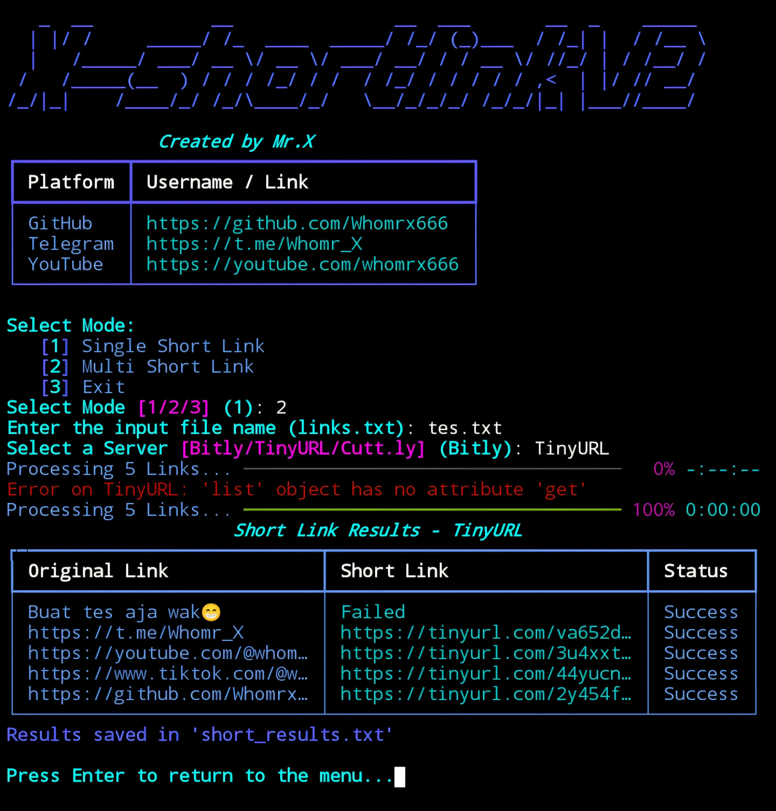

# X-shortlinkV2


## introduction
X-shortlinkV2 is a command-line tool to shorten links using various services such as Bitly, TinyURL, and Cutt.ly. It allows users to shorten single or multiple URLs with ease and track the status of each shortened link

## Instalations
```
$ pkg update -y && pkg upgrade -y
$ apt update -y && apt upgrade -y
$ pkg install git
$ pkg install python -y
$ git clone https://github.com/Whomrx666/X-shortlinkV2.git
$ cd X-shortlinkV2
$ bash install.sh
$ make run
```

## Instructions
- **first**: Install tools according to the instructions above
- **second**: After entering the tools, select one of the modes, no 1 or no 2
- **third**: If you choose number 1, just enter one link. If you choose number 2, you can create a list with a txt extension of as many links as you like
- **Fourth**: After that, select one of the three available shortlink options, such as Bitly, TinyURL, and Cutt.ly
- **last**: The tool will automatically create a shortlink for you

## Features
- **Single URL Shortener**: Shorten one link at a time.
- **Multiple URL Shortener**: Process a list of URLs from a file.
- **Supports multiple services**: Bitly, TinyURL, and Cutt.ly.
- **Progress indicators**: Shows progress while shortening links.
- **Output tables**: Neatly displays results with Rich library.
- **User-friendly interface**: Interactive prompts for easy navigation.

## Observation
This is a tool for education only, I am not responsible for any misuse
### Original Author
<a href="https://github.com/Whomrx666"></a>

### <<< If you copy , Then Give me The Credits >>>

## CONNECT WITH ME :

[](https://whomrxhackers.blogspot.com/)
[](https://twitter.com/whomrx666)
[](https://youtube.com/@whomrx666)
[](https://facebook.com/https://www.facebook.com/whomrx.666)
[](https://t.me/@Whomr_X)
[](mailto:whomrx666@gmail.com)
[](https://www.tiktok.com/@whomr.x)

**If you want to donate, click on the button**
<a href="https://saweria.co/whomrx"></a>

### Visitors :
